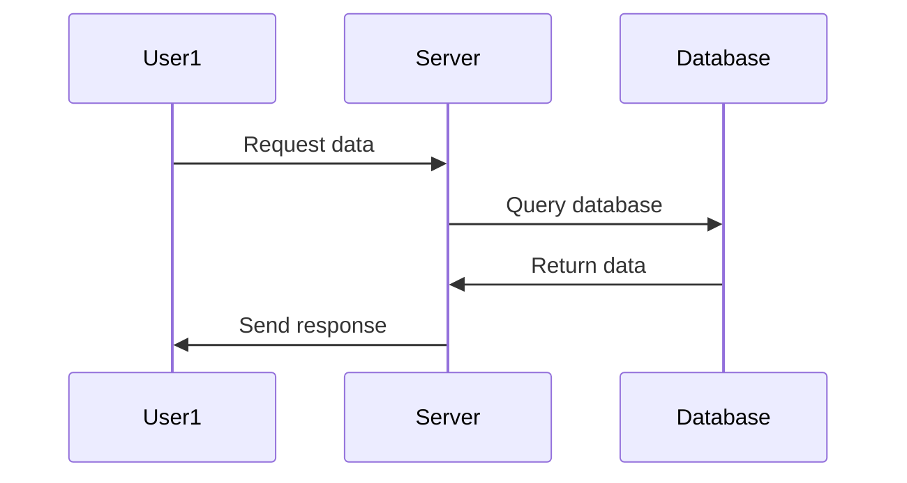

# Chapter 3: Type Inference
## What is a sequence diagram?
A sequence diagram is a visual representation of how different objects interact with each other in a system. It shows the flow of events and the interactions between objects over time.

## Walkthrough
Let's consider an example where we have two users interacting with a web application. We want to visualize this interaction using a sequence diagram.



In this example, we have three participants: `User1`, `Server`, and `Database`. The sequence diagram shows the flow of events:

*   User1 sends a request to the Server.
*   The Server queries the Database.
*   The Database returns data to the Server.
*   The Server sends the response back to User1.

## Internal Implementation
To implement this sequence diagram, we would need to write code that interacts with these different objects. Here's an example in Python:

```python
class User:
    def request_data(self):
        # Send a request to the server
        pass

class Server:
    def query_database(self, data):
        # Query the database and return data
        pass

    def send_response(self, data):
        # Send a response back to the user
        pass

class Database:
    def query(self, data):
        # Query the database
        pass

# Create instances of each class
user = User()
server = Server()
database = Database()

# Simulate interactions between objects
user.request_data()
server.query_database(database.query("data"))
server.send_response(user)
```

This code is simplified and doesn't actually interact with a web application. However, it demonstrates the basic idea behind sequence diagrams.

## Next Steps

Now that we've learned about sequence diagrams, let's move on to...

[Next Chapter Title](next_chapter_filename)

---

Generated by [AI Codebase Knowledge Builder](https://github.com/The-Pocket/Tutorial-Codebase-Knowledge)