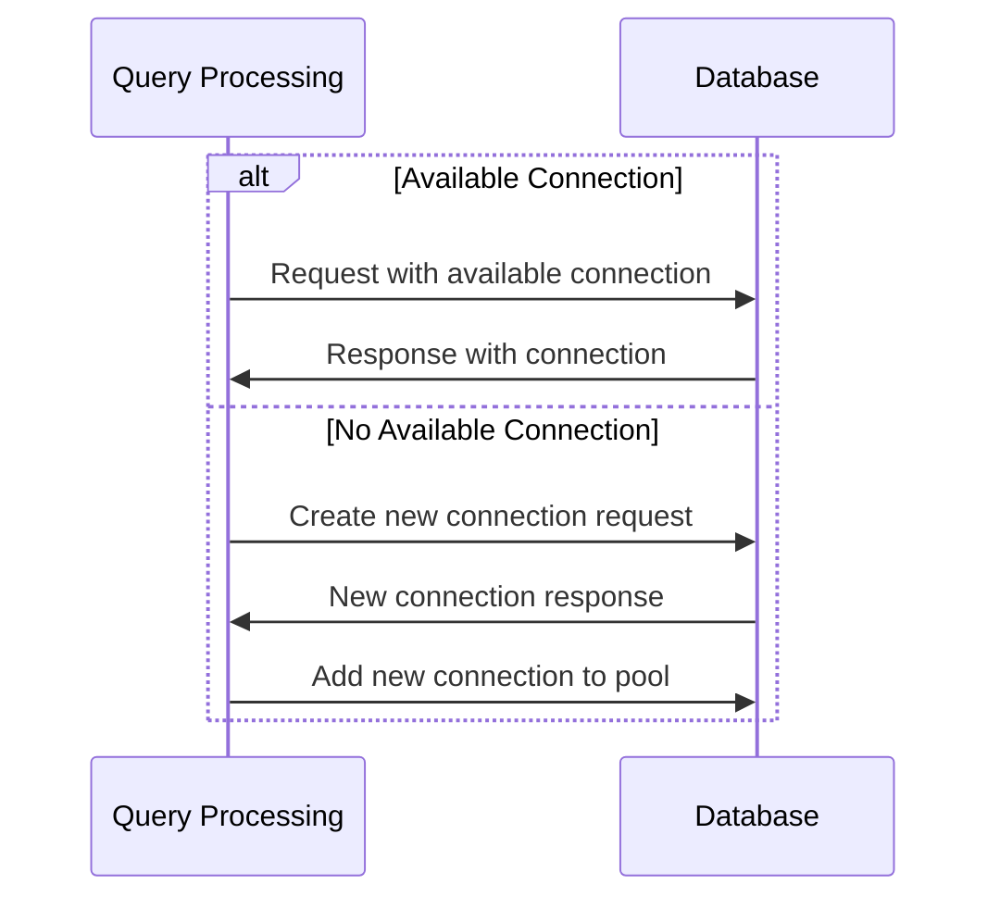

# Chapter 5: Connection Pooling
=====================

## Introduction
---------------

Connection pooling is a technique used in programming to improve the performance of database or network connections by reusing existing connections instead of creating new ones for each request.

## Central Use Case
-------------------

A common use case for connection pooling is in a web application that needs to execute multiple SQL queries against a database. Without connection pooling, the application would create a new connection to the database for each query, which can lead to performance issues and increased resource usage.

## Key Concepts
---------------

### Connection Pooling Algorithm

Connection pooling algorithms typically work as follows:

1.  Create a pool of connections to the database.
2.  When a request comes in, check if there is an available connection in the pool.
3.  If an available connection is found, reuse it for the current request.
4.  If no available connection is found, create a new connection and add it to the pool.

### Connection Pooling Parameters

Some common parameters used in connection pooling include:

*   **max connections**: The maximum number of connections allowed in the pool.
*   **min connections**: The minimum number of connections required in the pool.
*   **idle timeout**: The amount of time a connection can sit idle before being closed.

## How it Works
----------------

### Non-Code Walkthrough

When the application needs to execute a query, it first checks if there is an available connection in the pool. If one is found, it uses that connection. If not, it creates a new connection and adds it to the pool.

### Code Light Walkthrough



### Code Implementation

```python
import sqlite3

class ConnectionPool:
    def __init__(self, max_connections=10, min_connections=5):
        self.max_connections = max_connections
        self.min_connections = min_connections
        self.pool = []

    def get_connection(self):
        if not self.pool or len(self.pool) == 0:
            # Create a new connection if the pool is empty
            self.pool.append(sqlite3.connect("database.db"))
        else:
            # Reuse an existing connection from the pool
            connection = self.pool.pop(0)
            self.pool.append(connection)

    def release_connection(self, connection):
        # Add a connection back to the pool after it's been used
        self.pool.insert(0, connection)
```

## Example Use Case
-------------------

```python
import sqlite3

# Create a connection pool with 5 minimum and 10 maximum connections
pool = ConnectionPool(min_connections=5, max_connections=10)

while True:
    # Get an available connection from the pool
    conn = pool.get_connection()
    try:
        # Execute a query using the connection
        cur = conn.cursor()
        cur.execute("SELECT * FROM users")
        rows = cur.fetchall()

        # Print the results
        for row in rows:
            print(row)

    except Exception as e:
        # Release the connection back to the pool if an error occurs
        pool.release_connection(conn)
    finally:
        # Close the connection regardless of whether an exception occurred
        conn.close()
```

## Conclusion
--------------

Connection pooling is a powerful technique for improving the performance of database or network connections. By reusing existing connections, applications can reduce the overhead of creating new connections and improve overall performance.

Transition to Next Chapter:

[Next Chapter Title](filename.md)

---

Generated by [AI Codebase Knowledge Builder](https://github.com/The-Pocket/Tutorial-Codebase-Knowledge)