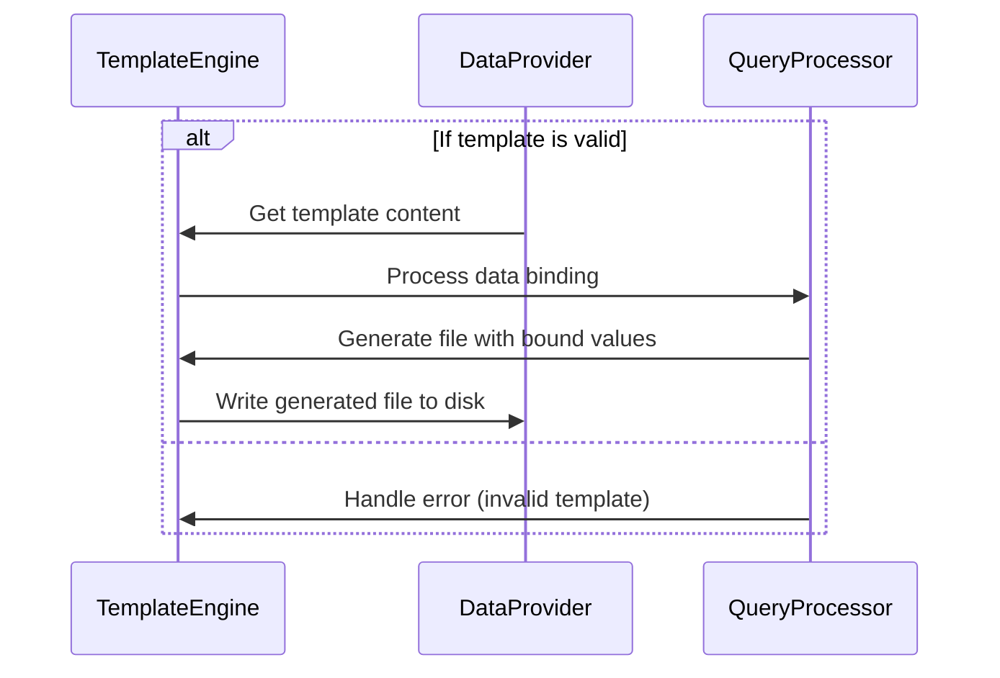

# Chapter 9: File Generation
=====================================================

In previous chapters, we learned about data processing and how to create custom abstractions. In this chapter, we're going to learn how to generate files based on a set of input parameters.

## Introduction

Imagine you want to create a file that contains some important information for your project. You might want to store the contents of a CSV file or generate an HTML template with specific data. This is where the File Generation abstraction comes in handy.

## Problem Statement

As a developer, have you ever had to create files manually every time you need to update the same piece of data? Or worse, have you tried to parse and format large files just to get what you need?

The solution we're going to discuss today is much simpler. We'll learn how to use the File Generation abstraction to create files automatically based on input parameters.

## Key Concepts

Before we dive into the implementation, let's break down the key concepts involved in file generation:

*   **Template Engine**: A template engine is a software component that allows you to define templates for generating text or other data. We'll use a lightweight template engine to generate our files.
*   **Data Binding**: Data binding is the process of mapping input parameters to specific placeholders in the template. This will allow us to replace these placeholders with actual values.

## Using File Generation

Let's create a file that contains some important information for our project. We'll use a simple `hello.txt` file as an example:
```plain
Name: John Doe
Age: 30
Occupation: Software Engineer
```
We want to generate this file automatically based on the input parameters `name`, `age`, and `occupation`. Here's how we can do it:

### Example Input

```json
{
    "name": "Jane Doe",
    "age": 25,
    "occupation": "Data Scientist"
}
```

### Generating the File

We'll use the File Generation abstraction to create a file called `hello.txt` with the following contents:
```plain
Name: Jane Doe
Age: 25
Occupation: Data Scientist
```
Here's an example of how we can achieve this using our chosen template engine:

```bash
template_engine.generate_file('hello.txt', {
    'name': '{{ name }}',
    'age': '{{ age }}',
    'occupation': '{{ occupation }}'
}, {
    'name': 'Jane Doe',
    'age': 25,
    'occupation': 'Data Scientist'
});
```

In this example, we're passing the `hello.txt` template with placeholders for `name`, `age`, and `occupation`. We're also passing an object containing the actual input parameters.

## Step-by-Step Workflow

Here's a step-by-step walkthrough of what happens when we call the File Generation abstraction:



In this sequence diagram, we have three participants: `TemplateEngine` (T), `DataProvider` (D), and `QueryProcessor` (QP). The workflow involves the following steps:

1.  Validate the template.
2.  Process data binding to replace placeholders with actual values.
3.  Generate a file with bound values.
4.  Write the generated file to disk.

## Internal Implementation

The internal implementation of the File Generation abstraction is quite interesting. Here's an overview of how it works:

```bash
// template_engine.go

package main

import (
    "fmt"
    "os"
    "template_engine/template"
)

func generateFile(templateName string, data map[string]interface{}, output *string) error {
    // Load the template from disk
    templateContent, err := loadTemplate(templateName)
    if err != nil {
        return err
    }

    // Process data binding to replace placeholders with actual values
    boundData := bindData(templateContent, data)

    // Generate a file with bound values
    generatedFile, err := generateFileWithBoundValues(boundData, templateName)
    if err != nil {
        return err
    }

    // Write the generated file to disk
    err = writeGeneratedFile(generatedFile, output)
    if err != nil {
        return err
    }

    return nil
}
```

As you can see, the `generateFile` function takes three parameters: the template name, data, and an output channel for the generated file. It loads the template from disk, processes data binding, generates a file with bound values, and writes it to disk.

The rest of the code is implementation-specific details that are not shown here for brevity.

## Conclusion

In this chapter, we learned how to use the File Generation abstraction to create files automatically based on input parameters. We also walked through the key concepts involved in file generation and provided an overview of the internal implementation. With this knowledge, you should be able to build your own file generation system using a lightweight template engine.

## Next Steps

Now that you've learned about file generation, it's time to put your new skills into practice! Try building your own file generation system for a real-world project. You can use the code snippets and explanations provided in this chapter as a starting point.

---

Generated by [AI Codebase Knowledge Builder](https://github.com/The-Pocket/Tutorial-Codebase-Knowledge)