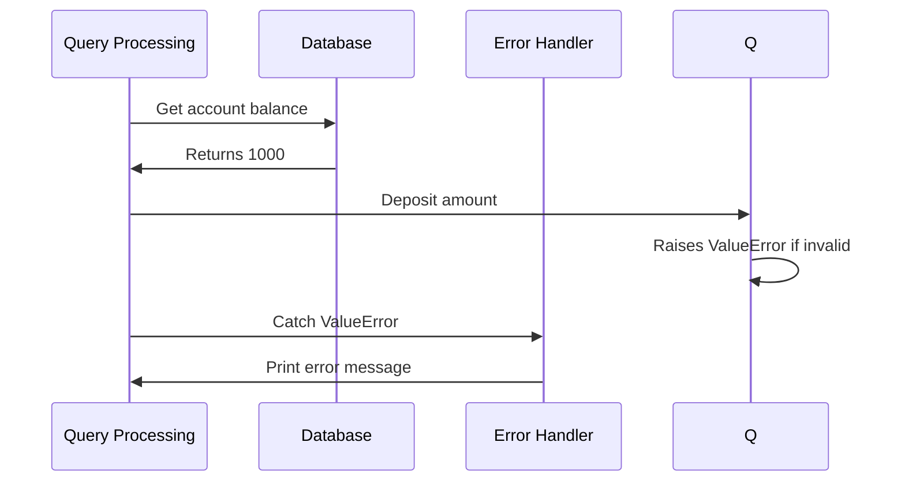

# Chapter 11: Error Handling
===============

Error handling is an essential part of software development. It allows us to anticipate and manage errors that may occur during the execution of our code. In this chapter, we will explore how to use error handling effectively.

## Why Error Handling Matters?

Error handling is crucial because it ensures that our software applications remain stable and functional even when unexpected issues arise. Without proper error handling, our applications can crash or behave erratically, leading to a poor user experience.

**A Concrete Example**

Let's consider an example of a simple banking application that allows users to deposit money into their accounts. Suppose we have the following code:

```python
def deposit(amount):
    account_balance = 1000
    if amount < 0:
        raise ValueError("Deposit amount cannot be negative")
    elif amount > 10000:
        raise ValueError("Deposit amount exceeds maximum allowed value")
    else:
        return account_balance + amount

try:
    amount = int(input("Enter deposit amount: "))
    result = deposit(amount)
except ValueError as e:
    print(f"Error: {e}")
```

In this example, we have a `deposit` function that takes an amount as input. If the amount is negative or exceeds the maximum allowed value, it raises a `ValueError`. We then catch this error in our main code and print an error message.

## Key Concepts

Here are the key concepts to understand:

### 1. Raising Errors

When we encounter an unexpected issue, such as an invalid deposit amount, we can raise an error using the `raise` keyword.

```python
if condition:
    raise ValueError("Error message")
```

### 2. Catching Errors

We use a `try-except` block to catch errors that are raised during the execution of our code.

```python
try:
    # Code that may raise an error
except ValueError as e:
    # Handle the error
    print(f"Error: {e}")
```

### 3. Error Types

There are two main types of errors:

*   **ValueError**: raised when a function receives an invalid value.
*   **TypeError**: raised when a function receives an argument with an incorrect type.

## Using Error Handling Effectively

To use error handling effectively, follow these best practices:

*   Keep your error messages concise and informative.
*   Use specific exception types to handle different types of errors.
*   Handle errors as close to the source as possible.

By following these guidelines and using error handling effectively, you can write more robust and reliable code that minimizes the risk of crashes or unexpected behavior.

## Internal Implementation

When we call the `deposit` function in our main code, the following sequence of events occurs:

1.  The input amount is read from the user.
2.  The deposit amount is passed to the `deposit` function.
3.  The `deposit` function checks if the amount is valid and raises a `ValueError` if it's not.
4.  Our main code catches the `ValueError` and prints an error message.



## Code Implementation

Here is the complete implementation of the `deposit` function:

```python
def deposit(amount):
    account_balance = 1000
    if amount < 0:
        raise ValueError("Deposit amount cannot be negative")
    elif amount > 10000:
        raise ValueError("Deposit amount exceeds maximum allowed value")
    else:
        return account_balance + amount

try:
    amount = int(input("Enter deposit amount: "))
    result = deposit(amount)
except ValueError as e:
    print(f"Error: {e}")
```

This implementation raises a `ValueError` if the deposit amount is invalid and catches it in our main code to handle the error.

---

Generated by [AI Codebase Knowledge Builder](https://github.com/The-Pocket/Tutorial-Codebase-Knowledge)