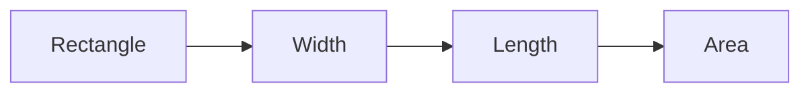
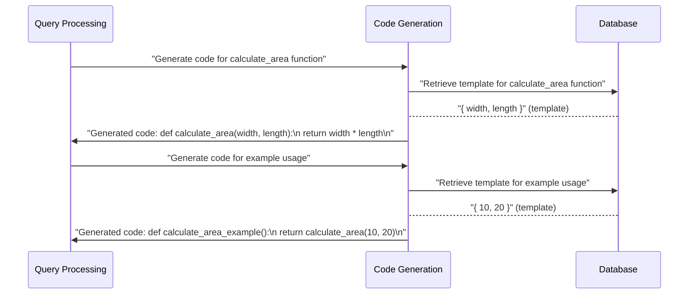

# Chapter 13: Code Generation

## Introduction

Code generation is an essential concept in software development that allows us to automate the creation of code. In previous chapters, we introduced various abstractions and techniques for solving problems. Today, we're going to explore how to use code generation to solve a common problem.

Let's consider a simple example. Suppose we want to generate code for a function that calculates the area of a rectangle. We can write this function manually, but with code generation, we can automate this process.

## Key Concepts

Code generation involves using an abstraction layer to encapsulate the logic of generating code. The key concept here is **templates**. A template is a pre-defined structure that contains placeholders for the actual values. When we generate code, we fill in these placeholders to create the final code.

Here's a simple example of what a template might look like:

In this example, `A` represents the input rectangle, `B` and `C` represent the width and length of the rectangle, respectively, and `D` represents the generated area.

## Using Code Generation

Let's write a code snippet that demonstrates how to use code generation:
```python
# Input parameters
width = 10
length = 20

# Generate code
code = f"def calculate_area(width, length):\n    return width * length\n"

print(code)
```
In this example, we define the `calculate_area` function and generate the code by filling in the placeholders with the actual values. The output is a string containing the generated code.

## Internal Implementation

Now, let's dive deeper into the internal implementation of code generation.

In this sequence diagram, we illustrate the flow of how code generation works. The `Query Processing` participant requests the `Code Generation` participant to generate code for a specific function. The `Code Generation` participant retrieves a template from the database and fills in the placeholders with the actual values.

## Conclusion

In this chapter, we explored how to use code generation to solve a common problem. We introduced the concept of templates and demonstrated how to use code generation to automate the creation of code. We also took a peek at the internal implementation of code generation, highlighting the flow of how it works.

With this knowledge, you're ready to start using code generation in your own projects. Remember to keep your templates simple and well-structured, and don't hesitate to ask if you have any questions or need further clarification.

[Next Chapter Title](next_chapter_filename.md)

---

Generated by [AI Codebase Knowledge Builder](https://github.com/The-Pocket/Tutorial-Codebase-Knowledge)