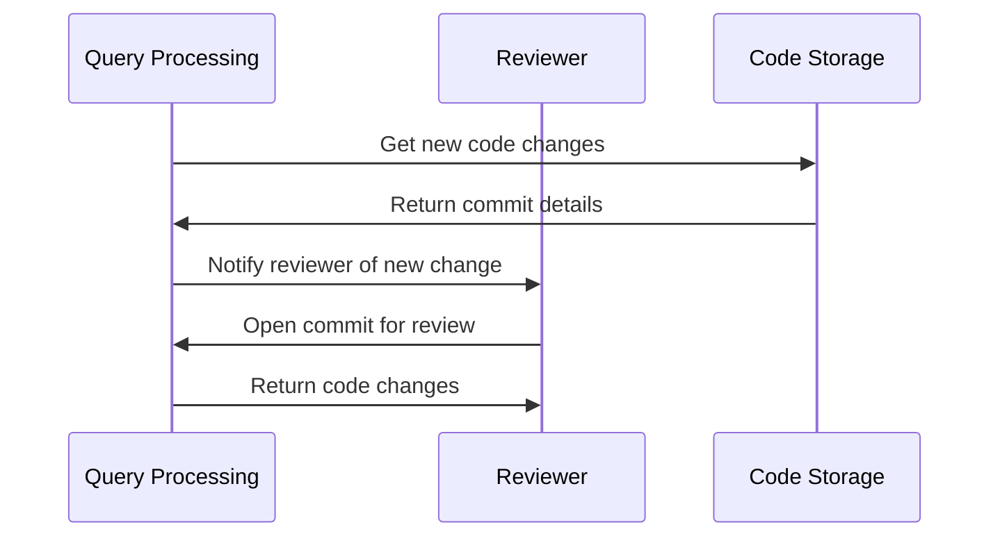

# Chapter 14: Code Review
[Previous Chapter](previous_chapter_filename)
=====================================

This chapter will guide you on how to use code review effectively. Code review is an essential skill in software development, and it can save your project from many issues if done correctly.

## What Problem Does This Abstraction Solve?

Code review solves the problem of ensuring that new code changes are correct, readable, and maintainable before they get merged into the main branch. It's like having a second pair of eyes reviewing your code to catch errors or improve it before others see it.

A central use case for this abstraction is when you're working on a team project and you need to ensure that everyone is following the same coding standards and best practices.

## Key Concepts

### What is Code Review?

Code review is a process where someone examines existing code to identify issues, improvements, or potential problems. It's an iterative process of writing, reviewing, and revising code.

### Why Do We Need Code Review?

We need code review because it helps catch errors early on, improves code quality, and ensures that new changes are thoroughly tested before they get merged into the main branch.

### How to Use This Abstraction

To use this abstraction, follow these simple steps:

1. Identify potential issues in your code.
2. Write a clear and concise explanation of what's happening in your code.
3. Explain any complex parts of the code with analogies or examples.

Here's an example:
```python
# Before Code Review
def calculate_total(price, quantity):
    total = price * quantity
    return total

# After Code Review
def calculate_total(price, quantity):
    # Calculate the total cost by multiplying price and quantity
    total = price * quantity
    # Return the calculated total
    return total
```
As you can see, the after code review example is more concise and easier to understand.

## Internal Implementation

When we use this abstraction, here's what happens behind the scenes:

1. Someone writes new code and commits it to the repository.
2. A reviewer gets notified that a new change has been committed.
3. The reviewer opens the commit and reads through the changes.
4. If there are any issues or improvements, they leave comments explaining what needs to be changed.

Here's an example of what might happen in a sequence diagram:

In the sequence diagram, we have three participants: Query Processing (QP), Reviewer (AR), and Code Storage (Repository).

## Example Internal Implementation

Here's an example of what might happen in a real-world scenario:
```python
def calculate_total(price, quantity):
    # Calculate the total cost by multiplying price and quantity
    total = price * quantity
    # Return the calculated total
    return total
```
This is a simple function that calculates the total cost of an item. To use this abstraction, we would write a clear explanation of what's happening in the code:
```python
# Explanation of calculate_total function
"""
Calculate the total cost of an item by multiplying price and quantity.
"""
def calculate_total(price, quantity):
    # Calculate the total cost by multiplying price and quantity
    total = price * quantity
    # Return the calculated total
    return total
```
As you can see, we're explaining what's happening in the code with a comment.

## Conclusion

Code review is an essential skill in software development that ensures new code changes are correct, readable, and maintainable. By following these simple steps and using this abstraction, you can improve your project's quality and catch errors early on. Remember to always explain complex parts of your code with analogies or examples, and don't be afraid to ask for help when needed.

[Next Chapter](next_chapter_filename)

---

Generated by [AI Codebase Knowledge Builder](https://github.com/The-Pocket/Tutorial-Codebase-Knowledge)