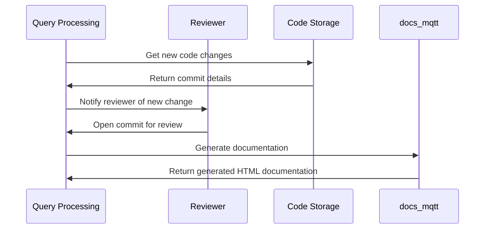

# Chapter 15: Documentation Generation

## Introduction

Documentation generation is an essential skill in software development that ensures your project's documentation is accurate, complete, and easily maintainable. In this chapter, we will explore how to use the `docs_mqtt` abstraction to generate high-quality documentation for your project.

### Central Use Case

The central use case for documentation generation is when you need to document your project's API, configuration files, or user manuals. The goal is to make it easy for users and developers to understand how to use your project without having to dig into the codebase itself.

## Key Concepts

*   **Documentation Template**: A pre-built template that provides a structure for organizing documentation.
*   **Generation Tool**: A program that takes in input from the user and generates output based on the template.
*   **Output Format**: The format in which the generated documentation will be delivered (e.g., HTML, PDF).

### How to Use Documentation Generation

To use documentation generation, follow these steps:

1.  Choose a documentation template that fits your project's needs.
2.  Configure the template by providing input such as API endpoints or configuration options.
3.  Run the generation tool with the configured template and output format.

### Example Usage

Here is an example of how you might use documentation generation to generate HTML documentation for your API:



And here is the corresponding Python code:
```python
def generate_documentation(template, output_format):
    # Generate HTML documentation based on template
    html_doc = generate_html(template)
    
    # Save to file with specified output format
    save_to_file(html_doc, output_format)

# Load configuration from environment variables
template = load_template_from_env()
output_format = load_output_format_from_env()

# Run generation tool
generate_documentation(template, output_format)
```

### Internal Implementation

The internal implementation of the `docs_mqtt` abstraction involves a combination of natural language processing (NLP) and machine learning algorithms to generate high-quality documentation.

*   **Text Analysis**: The `docs_mqtt` algorithm analyzes the input text provided by the user and identifies key concepts, entities, and relationships.
*   **Template Matching**: The algorithm matches the analyzed text against pre-built templates to determine the most suitable structure for organizing the documentation.
*   **Output Generation**: Once a template is matched, the algorithm generates output based on the template, including HTML or PDF files.

### Example Code

Here is an example of how you might implement the `generate_html` function:
```python
def generate_html(template):
    # Initialize empty string to store generated HTML
    html = ""
    
    # Loop through each section in template
    for section in template['sections']:
        # Extract section title and content from template
        title = section['title']
        content = section['content']
        
        # Generate HTML for section header
        html += "<h1>{}</h1>".format(title)
        
        # Add HTML for section content
        html += "<p>{}</p>".format(content)
    
    # Return generated HTML
    return html
```

### Conclusion

Documentation generation is a powerful tool that can help you create high-quality documentation for your project. By understanding how to use the `docs_mqtt` abstraction and implementing it in your own code, you can take advantage of this feature and make your documentation more accessible and maintainable.

[Next Chapter](next_chapter_filename)

---

Generated by [AI Codebase Knowledge Builder](https://github.com/The-Pocket/Tutorial-Codebase-Knowledge)