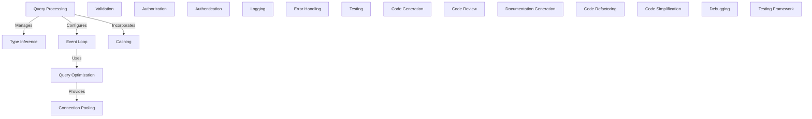

# Tutorial: unifiednamespace

A high-level overview of the project's main purpose and functionality in a few beginner-friendly sentences.
Can span multiple lines with **bold** and *italic* for emphasis.

**Source Repository:** [https://github.com/alex-macedo/unifiednamespace](https://github.com/alex-macedo/unifiednamespace)

## Chapters

1. [Query Processing](01_query_processing.md)
2. [Event Loop](02_event_loop.md)
3. [Type Inference](03_type_inference.md)
4. [Query Optimization](04_query_optimization.md)
5. [Connection Pooling](05_connection_pooling.md)
6. [Caching](06_caching.md)
7. [Validation](07_validation.md)
8. [Authorization](08_authorization.md)
9. [Authentication](09_authentication.md)
10. [Logging](10_logging.md)
11. [Error Handling](11_error_handling.md)
12. [Testing](12_testing.md)
13. [Code Generation](13_code_generation.md)
14. [Code Review](14_code_review.md)
15. [Documentation Generation](15_documentation_generation.md)
16. [Code Refactoring](16_code_refactoring.md)
17. [Code Simplification](17_code_simplification.md)
18. [Debugging](18_debugging.md)
19. [Testing Framework](19_testing_framework.md)

---

Generated by [AI Codebase Knowledge Builder](https://github.com/The-Pocket/Tutorial-Codebase-Knowledge)